# 簡易コーディングエージェントのグラフ設計

実装は [`coding_agent.py`](./coding_agent.py) を参照。

「計画 → 実装 → 実行 → 失敗なら振り返って再実装」というループを持つ最小構成。

## 有向グラフ

```mermaid
flowchart TD
    START([START]) --> plan
    plan[plan<br/>タスクを分解して計画を立てる] --> write_code
    write_code[write_code<br/>コードを生成・修正する] --> run_code
    run_code[run_code<br/>実行・テストして結果を得る] --> route{route<br/>条件付きエッジ}
    route -- テスト成功 --> finalize
    route -- 失敗 かつ 試行回数 < MAX --> reflect
    route -- 失敗 かつ 試行回数 >= MAX --> finalize
    reflect[reflect<br/>エラーを分析し改善方針を作る] --> write_code
    finalize[finalize<br/>結果を整形して返す] --> END([END])
```

`route` はノードではなく、`run_code` の後に呼ばれる条件付きエッジ用の関数。

## ノードの役割

| ノード | 種類 | 役割 |
|---|---|---|
| `plan` | LLM | タスクを実装手順に分解する |
| `write_code` | LLM | 計画（と前回の改善方針）からコードを書く |
| `run_code` | ツール（LLM 不使用） | subprocess で実行し、終了コードと出力を State に入れる |
| `reflect` | LLM | エラー出力を読み、次に何を直すかを言語化する |
| `finalize` | 通常関数 | 成功・失敗を整えて最終出力にする |

## State

| キー | 内容 |
|---|---|
| `task` | ユーザーの依頼 |
| `plan` | 実装計画 |
| `code` | 現在のコード |
| `test_output` | 実行結果（stdout + stderr） |
| `passed` | 成功したか |
| `review` | `reflect` が出した改善方針 |
| `iteration` | 試行回数 |
| `result` | 最終出力 |

各ノードは差分（dict）だけを返し、LangGraph が State にマージする。

## 学べるポイント

- **State の設計**: ノードは更新分だけを返す。
- **条件付きエッジ**: `route` の戻り値で分岐先が決まる。
- **ループ**: `reflect → write_code` の戻りエッジで再試行し、`iteration` と `MAX_ITERATIONS` で無限ループを防ぐ。

## 発展案

1. ファイル操作や grep をツール化し、`agent` ノードと `ToolNode` の往復（ReAct 型）にする。
2. Checkpointer（`MemorySaver`）で途中状態を保存する。
3. `interrupt` による human-in-the-loop で、`run_code` の前に承認を挟む。
4. 実行前にコードをレビューする `review` ノードを追加する。

## 注意

`run_code` は生成コードをそのままローカルで実行する。慣れてきたら Docker などのサンドボックスに切り替えること。
